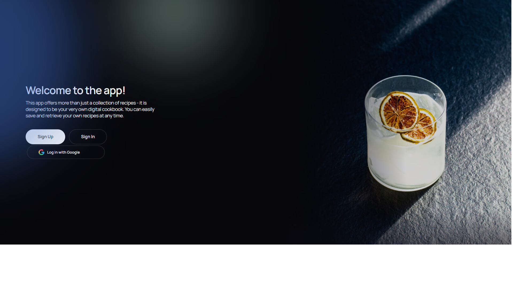

# Drink Master App



Drink Master, a handy app designed to help you have a good time with your
friends, impress your new friends with your skills, or find something new for
yourself. Search, create, and share a wide variety of drinks.

## Links

- 🖼️ FRONTEND - https://maksym-shcherbak.github.io/makeYourParty/
- ✨ FRONTEND REPO - https://github.com/Maksym-Shcherbak/makeYourParty
- 🛠️ BACKEND REPO - https://github.com/Pasha2407/project-backend
- 🔗 API_URL - https://project-backend-0pzg.onrender.com/
- 📄 API_DOCS(Swagger) - https://project-backend-0pzg.onrender.com/api-docs/

## Table of Contents

- [Features](#features)
- [Routing](#routing)
- [Technologies](#technologies)
- [Installation](#installation)
- [Contributors](#contributors)

## Features

- Google authorization and user account to access the application, where you can
  change your avatar and name.<br />

- Hundreds of drink recipes to browse and search by filters.<br />

- The ability to add drinks to your favorites for quick access at your
  convenience.<br />

- The ability to create your own recipes that can be shared with other
  users.<br />

## Routing

The app uses React Router for navigation.

- `/` - Home page

 The home page features the most popular
drinks from four categories, and you can go straight to creating your own drink
or browse other drinks.

- `/drinks` - Search drink

 All drinks are presented on this page, and
you can also search by name or using filters. You can also view detailed
information about each drink.

- `/add` - Add your own drink

 This page will help you create your unique
drink recipe that you can add to your favorites. Other users will also be able
to use your recipe. All the drinks you make will be displayed on a separate
page.

## Technologies

<p align="center">
  <b>Drink Master frontend part was built using the following technologies & tools:</b>
</p>
<p align="center">
  &nbsp;
  &nbsp;
  &nbsp;
  &nbsp;
  &nbsp;
  &nbsp;
  &nbsp;
  &nbsp;
  &nbsp;
  &nbsp;
  &nbsp;
  &nbsp;

</p>

<p align="center">
  <b>Drink Master backend part was built using the following technologies & tools:</b>
</p>
<p align="center">
  &nbsp;
  &nbsp;
  &nbsp;
  &nbsp;
  &nbsp;
  &nbsp;
  &nbsp;
  &nbsp;
</p>

## Installation

1. Clone the repo

```sh
git clone https://github.com/Maksym-Shcherbak/makeYourParty.git
```

2. Install NPM packages

```sh
npm install
```

3. Run the app

```sh
npm run dev
```

4. Open the app in your browser

```sh
http://localhost:5173
```

5. Enjoy!

## Contributors

- **Team lead:** [Maksym Shcherbak](https://github.com/Maksym-Shcherbak) ||
  [](https://www.linkedin.com/in/maksym-shcherbak/)
- **Scrum master:** [Kateryna Vasylieva](https://github.com/Katysha94) ||
  [](https://www.linkedin.com/in/katerina-vasylieva-303747274/)
- **Team lead of BACKEND:** [Pavlo Khimchuk](https://github.com/Pasha2407) ||
  [](https://www.linkedin.com/in/pavlo-khimchuk/)

- **Developers:** [Olha Chala](https://github.com/Chalaya22) ||
  [](https://www.linkedin.com/in/olha-chala-5ba223295/)
  | [Olena Kaspruk ](https://github.com/Ferst1) ||
  [](https://www.linkedin.com/in/coding777/)
  | [Denys Yehorov](https://github.com/dozeran) ||
  [](https://www.linkedin.com/in/denys-yehorov/)
  | [Vladyslav Todosiichuk](https://github.com/VladyslavTodo) |
  [Valerii Lykhatskyi](https://github.com/ValeraBladee) |
  [Mariia Beisiuk](https://github.com/mariiaglushak) |
  [Artem Cherchuk](https://github.com/ArtemCherchuk) ||
  [](https://www.linkedin.com/in/artem-cherchuk/)
